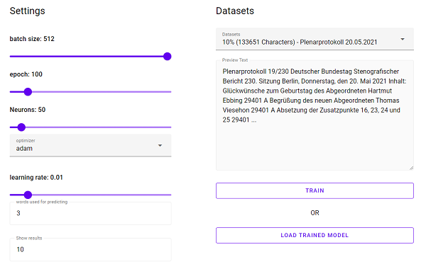

# Dokumentation

## Aufgabenstellung

Trainieren Sie ein Recurrent Neural Network (RNN) auf der Basis der Daten (siehe unten) zur Wortvorhersage (Next Word Prediction). Sie können auch einen anderen Datensatz selber aussuchen, oder eigene Texte, z. B. Ihre E-Mails, zum Training verwenden (überlegen Sie, ob sich daraus ein Datenschutzproblem ergibt).

## Experimente und Fragestellungen

Experimentieren Sie mit der Netzwerkarchitektur. Dokumentieren und begründen Sie Ihre finale Architektur.

Notieren Sie als Resultat wie oft die Vorhersage genau richtig ist, und wie oft das korrekte nächste Wort unter den ersten k Worten die sie vorhersagen liegt, mit k gleich 5, 10, 20 und 100. Sie können auch die Perplexity (siehe Hintergrund) als Maß Ihrer Resultate nutzen.

### Hinweise

Wort Vorhersage ist eine Multi-Class Classification. Nutzen Sie als Objektivfunktion Categorical Cross-Entropy Loss.
Sie können auch LSTM als RNN einsetzen.

### Test

### ***Bestsettings***

### ***Results***

| words | result | 5 | 10 | 20 | 100 | position| accuracy |
|-------|--------|---|----|----|-----|----------|----------|
| zum Geburtstag des | abgeordneten | X | - | - | - | 1 |92.91% |
| Geburtstag des abgeordneten | steffen | - | - | X | - | 18 | 0.91% |
| weiterer abgeordneter und | der | X | - | - | - | 1 | 100.00% |
| als Voraussetzung für |  Klimaneutralität  | - | - | - | - |  2839 | 0% |
| in den Flughafenregionen |  besser  | X | - | - | - | 1 | 16.77% |
| der Hauptuntersuchungsintervalle für |  Oldtimer  | - | - | - | - | 3148 | 0% |
